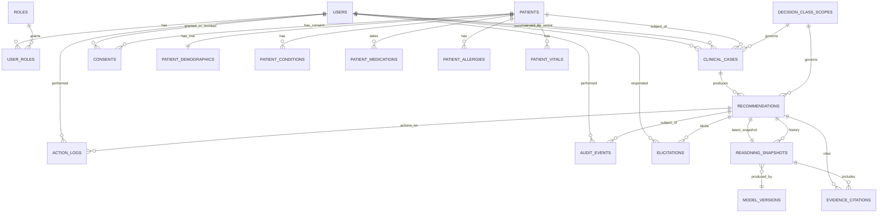
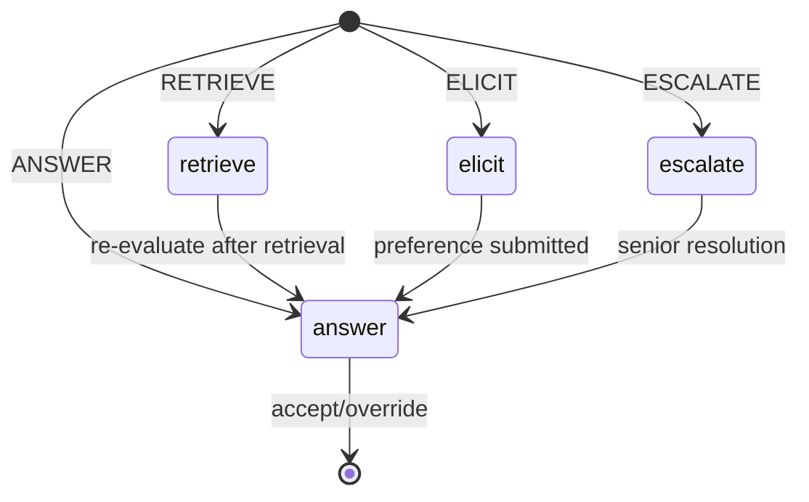

# ConsiliumMD

> **When clinical guidelines disagree, ConsiliumMD tells you whether that's because the evidence is unsettled or because it's a judgment call — and routes you to the right next step either way.**

ConsiliumMD is a multi-role clinical decision-support web product built around the
**CARMA** research engine (Robust Posterior Decomposition / EVPI-gated retrieval /
normative preference elicitation). It wraps CARMA's reasoning core in a role-aware
web application that a hospital or clinic could plausibly deploy, surfacing CARMA's
contribution (epistemic vs. normative conflict typing, gated retrieval/elicitation)
**underneath** an ordinary clinical workflow, not in front of it.

---

## Table of contents

1. [What this product is](#what-this-product-is)
2. [Repository layout](#repository-layout)
3. [Architecture at a glance](#architecture-at-a-glance)
4. [The four routing states — the spine of the UX](#the-four-routing-states--the-spine-of-the-ux)
5. [Roles](#roles)
6. [Tech stack](#tech-stack)
7. [Quick start (local dev)](#quick-start-local-dev)
8. [Configuration](#configuration)
9. [Database & ER model](#database--er-model)
10. [Backend — modules, endpoints, tests](#backend--modules-endpoints-tests)
11. [Frontend — pages, components, design tokens](#frontend--pages-components-design-tokens)
12. [Reasoning provider abstraction](#reasoning-provider-abstraction)
13. [Audit logging & compliance](#audit-logging--compliance)
14. [Phased delivery plan](#phased-delivery-plan)
15. [CARMA integration (Phase 2)](#carma-integration-phase-2)
16. [Ethical guardrails — built into code](#ethical-guardrails--built-into-code)
17. [Success metrics](#success-metrics)
18. [Risks](#risks)
19. [Demo script](#demo-script)
20. [Development conventions](#development-conventions)
21. [References](#references)

---

## What this product is

CARMA is a research artifact. Almost no clinician interacts with a research
artifact — they interact with a *product* that fits into how their clinic or
ward actually works. **ConsiliumMD is that product.** It is not the engine; it
is the product surface that exposes the engine inside an ordinary clinical
workflow.

The hard rule:

> ConsiliumMD never issues a final, unreviewable clinical decision. Every
> output is a recommendation with a visible confidence/uncertainty type, a
> stated rationale, and a one-click path to a human.

---

## Repository layout

```
ConsiliumMD/
├── backend/                    FastAPI application
│   ├── app/                    source modules
│   │   ├── main.py             app factory, CORS, lifespan
│   │   ├── config.py           Pydantic Settings
│   │   ├── deps.py             auth, RBAC, DB session
│   │   ├── db/                 SQLAlchemy base, session, Alembic env
│   │   ├── models/             ORM models (one per table)
│   │   ├── schemas/            request/response DTOs
│   │   ├── api/                routers
│   │   ├── services/           reasoning provider, audit, safety, consent
│   │   └── core/               security, RBAC matrix
│   ├── tests/                  pytest suite
│   ├── alembic/                migrations
│   ├── pyproject.toml
│   ├── Dockerfile
│   └── .env.example
├── frontend/                   React 18 + TypeScript + Vite
│   ├── src/
│   │   ├── app/                router, providers
│   │   ├── components/         shared UI
│   │   ├── features/           doctor / reviewer / admin / auth
│   │   ├── lib/                api, auth, reasoning-state helpers
│   │   ├── types/              API DTO mirrors
│   │   └── styles/             Tailwind config + tokens
│   ├── package.json
│   ├── vite.config.ts
│   ├── Dockerfile
│   └── index.html
├── docs/
│   ├── architecture.md
│   ├── api.md
│   ├── data-model.md           ER diagrams + table notes
│   └── compliance.md
├── docker-compose.yml
├── .gitignore
└── README.md
```

CARMA lives in a sibling folder (`D:\Documents\HelloMed_X_CARMA\CARMA\`) and is
**read-only reference material**. ConsiliumMD never edits anything in CARMA and
never imports CARMA's Python at runtime — when Phase 2 integration happens, it
talks to CARMA over HTTP.

---

## Architecture at a glance

```
┌─────────────────────────────┐
│        Web Frontend         │   React (role-gated views, one shell app)
│  Doctor / Reviewer / Admin   │
└──────────────┬───────────────┘
               │ REST (+ optional WebSocket for live updates)
┌──────────────▼───────────────┐
│         API Gateway          │   FastAPI (auth, RBAC, rate limiting)
│  /auth /users /patients       │
│  /cases /recommendations      │
│  /review /audit /reasoning    │
└──────────────┬───────────────┘
               │
   ┌───────────┼──────────────────────────┐
   │           │                          │
┌──▼────────┐ ┌▼───────────────────┐  ┌──▼─────────────┐
│ EHR/      │ │ Reasoning Service  │  │ Audit &        │
│ Patient   │ │ (ReasoningProvider │  │ Compliance     │
│ Data      │ │  protocol)         │  │ Service        │
│ (Postgres │ │   ├ MockProvider   │  │ (append-only   │
│   /SQLite │ │   └ CARMAAdapter   │  │  audit_events) │
│   for dev)│ └────────┬───────────┘  └────────────────┘
└───────────┘          │ HTTP (future)
                       │
              ┌────────▼────────┐
              │     CARMA        │  (future; sibling folder)
              │ Reasoning Engine │
              └──────────────────┘
```

Only one place in the codebase knows that reasoning comes from "somewhere"
— `backend/app/services/reasoning/`. The rest of the system speaks in terms of
`Recommendation` + `RoutingDecision` + `ConflictTypeLabel`.

---

## The four routing states — the spine of the UX

The reasoning engine's `RoutingDecision` has four possible values, and every
doctor-facing case is in exactly one of the four corresponding UI states at
any time. There is no fifth "processing, who knows" state.

| Engine `RoutingDecision` | Conflict-type label shown | Doctor sees |
|---|---|---|
| `answer` | *Evidence Gap — resolved* | Direct recommendation, evidence cited |
| `retrieve` | *Evidence Gap — checking further* | "Checking one more source" loading state, then re-evaluates |
| `elicit` | *Judgment Call* | Explicit tradeoff statement, waiting on doctor/patient preference input |
| `escalate` | *Under Review* | Routed to Senior Clinician queue, with RPD's identifiability flag shown (why it couldn't be typed) |

The mapping engine state → UI state is the **single source of truth** in
`backend/app/services/reasoning/states.py` and `frontend/src/lib/reasoning-states.ts`.

---

## Roles

| Role | What they do |
|---|---|
| **Doctor / Clinician** | Owns cases, sees recommendation cards, can accept / request more evidence / escalate / override (with rationale). |
| **Senior Clinician / Reviewer** | Receives escalations; resolves cases the system marks non-identifiable or high-EVPI. The human backstop the whole system routes to, not around. |
| **Admin / Compliance Officer** | Manages users/roles, reads the audit log, exports audit CSV, tracks which model version produced which historical recommendation. |
| **Nurse / Clinical Staff** *(schema reserved)* | Task execution, alert feed. UI deferred to Phase 4 per spec §8. |
| **Patient** *(out of MVP)* | Plain-language care-plan view, consent screens. Schema reserved; UI deferred. |

The schema reserves these roles today so a populated DB doesn't need a
disruptive migration when Phase 4 lands.

---

## Tech stack

| Layer | Choice | Notes |
|---|---|---|
| Frontend | **React 18 + TypeScript + Vite** | TanStack Query, React Router v6, Tailwind CSS |
| Backend | **FastAPI** + Uvicorn | Pydantic v2 |
| ORM / migrations | **SQLAlchemy 2.x** + **Alembic** | Postgres in prod; SQLite for local dev / tests |
| Database | **PostgreSQL 15** (prod) / **SQLite** (dev) | Both supported behind a single connection-string switch |
| Auth | **JWT** (HS256) + bcrypt | Access + refresh tokens |
| RBAC | **Permission matrix** in `app/core/rbac.py` | Role-based; explicit, not hidden |
| Audit | **Append-only** `audit_events` table | DB trigger blocks UPDATE/DELETE |
| Reasoning | **`ReasoningProvider` protocol** | `MockReasoningProvider` ships; `CARMAResponseAdapter` is the Phase 2 placeholder |
| Containerization | **Docker Compose** | `db`, `backend`, `frontend` services |

---

## Quick start (local dev)

### Prerequisites
- Python 3.11+ (tested on 3.14)
- Node 18+ (tested on 24)
- (Optional) Docker Desktop — for the Postgres path

### Backend

```bash
cd backend
python -m venv .venv
.\.venv\Scripts\Activate.ps1
pip install -e .
cp .env.example .env
alembic upgrade head
python -m app.db.seed
uvicorn app.main:app --reload --port 8000
```

The backend boots on `http://localhost:8000`. OpenAPI docs at
`http://localhost:8000/docs`.

### Frontend

```bash
cd frontend
npm install
npm run dev
```

The frontend boots on `http://localhost:5173`. It calls the backend on
`http://localhost:8000` by default.

### Seeded users (dev only)

| Email | Role | Password |
|---|---|---|
| `admin@consilium.md` | admin | `admin1234` |
| `doctor@consilium.md` | doctor | `doctor1234` |
| `reviewer@consilium.md` | senior_clinician | `reviewer1234` |
| `nurse@consilium.md` | nurse | `nurse1234` |

**Never use these credentials in a non-development environment.**

### Docker (Postgres path)

```bash
docker compose up --build
```

This brings up Postgres on `5432`, the backend on `8000`, and the frontend on
`5173`. The backend container runs `alembic upgrade head` and the seed script
on first boot.

---

## Configuration

`backend/.env.example` documents every setting:

```
DATABASE_URL=sqlite:///./consilium.db            # dev default
# DATABASE_URL=postgresql+psycopg2://consilium:consilium@db:5432/consilium

JWT_SECRET=change-me
JWT_ALG=HS256
JWT_ACCESS_TTL_MIN=60
JWT_REFRESH_TTL_MIN=1440

REASONING_PROVIDER=mock                          # "mock" | "carma"
CARMA_BASE_URL=http://carma:8100                 # Phase 2
CARMA_API_KEY=

CORS_ORIGINS=http://localhost:5173

LOG_LEVEL=INFO
```

---

## Database & ER model

Full per-table notes live in [`docs/data-model.md`](docs/data-model.md). The
canonical ER diagram is here:



### State machine: recommendation lifecycle

```
pending → retrieved → answered → (accepted | overridden | escalated | elicit_pending)
                                    elicit_pending → answered (after user input)
                                    escalated → under_review → resolved
```

Every action writes **one** `audit_events` row, **one** `action_logs` row, and
(where applicable) updates `recommendations.state` — in a single DB transaction.
Partial state is unreachable.

### State machine: routing decision → UI state



---

## Backend — modules, endpoints, tests

### Module map

```
backend/app/
├── main.py                  app factory, CORS, lifespan
├── config.py                Pydantic Settings (env-driven)
├── deps.py                  DB session, current_user, require_role
├── db/
│   ├── base.py              SQLAlchemy declarative Base
│   ├── session.py           engine, SessionLocal, get_db
│   ├── migrations/          Alembic env + versions/
│   └── seed.py              demo users + seeded cases
├── models/                  ORM models (one per table)
├── schemas/                 Pydantic v2 request/response DTOs
├── api/
│   ├── auth.py
│   ├── users.py
│   ├── patients.py
│   ├── cases.py
│   ├── recommendations.py
│   ├── review.py
│   ├── audit.py
│   └── reasoning.py
├── services/
│   ├── reasoning/
│   │   ├── provider.py        abstract ReasoningProvider
│   │   ├── states.py          RoutingDecision ↔ ConflictTypeLabel mapping
│   │   ├── mock_provider.py   MockReasoningProvider
│   │   ├── carma_adapter.py   Phase 2 placeholder
│   │   ├── orchestrator.py    provider selection + retry/timeout
│   │   └── seeded_cases.json  the 6 seeded clinical cases
│   ├── audit.py               append-only writer
│   ├── safety_auditor.py      rule-check vs patient record
│   └── scope.py               decision_class_scopes enforcement
└── core/
    ├── security.py            bcrypt + JWT
    └── rbac.py                role → permission matrix
```

### Endpoint summary

```
POST   /api/v1/auth/login
POST   /api/v1/auth/refresh
GET    /api/v1/auth/me

GET    /api/v1/users
POST   /api/v1/users
PATCH  /api/v1/users/{id}
POST   /api/v1/users/{id}/roles
DELETE /api/v1/users/{id}/roles/{role_id}

GET    /api/v1/patients
POST   /api/v1/patients
GET    /api/v1/patients/{id}
PATCH  /api/v1/patients/{id}/conditions
PATCH  /api/v1/patients/{id}/medications
PATCH  /api/v1/patients/{id}/allergies
POST   /api/v1/patients/{id}/vitals

GET    /api/v1/cases
POST   /api/v1/cases
GET    /api/v1/cases/{id}
GET    /api/v1/decision-classes

POST   /api/v1/cases/{case_id}/recommendations
GET    /api/v1/cases/{case_id}/recommendations
GET    /api/v1/recommendations/{id}
GET    /api/v1/recommendations/{id}/reasoning-trail
POST   /api/v1/recommendations/{id}/accept
POST   /api/v1/recommendations/{id}/request-evidence
POST   /api/v1/recommendations/{id}/escalate
POST   /api/v1/recommendations/{id}/override
POST   /api/v1/recommendations/{id}/elicit

GET    /api/v1/review/queue
POST   /api/v1/review/{recommendation_id}/resolve

GET    /api/v1/audit/events
GET    /api/v1/audit/events/export.csv
GET    /api/v1/audit/model-versions

GET    /api/v1/health
```

### Tests

```bash
cd backend
pytest -q
```

Coverage:
- All endpoints have a happy-path test.
- RBAC: every role-gated endpoint has a denial test (e.g., nurse calling
  `/recommendations/{id}/accept` returns 403, not 404).
- State machine: every invalid transition returns 409.
- Audit: every state-changing action writes an `audit_events` row.
- Mock provider: stable routing per case id; `RETRIEVE → ANSWER` transition;
  blocked decision classes return 409.
- Append-only audit: attempts to UPDATE/DELETE `audit_events` raise.

---

## Frontend — pages, components, design tokens

### Pages by role

| Path | Role | Purpose |
|---|---|---|
| `/login` | unauthenticated | Email + password |
| `/doctor` | doctor | Dashboard: active cases, pending recommendations |
| `/doctor/cases/:id` | doctor | Case detail + recommendation card |
| `/reviewer/queue` | senior_clinician | Escalation queue |
| `/reviewer/cases/:id` | senior_clinician | Escalation detail + resolve form |
| `/admin/users` | admin | User management |
| `/admin/audit` | admin | Audit log + CSV export |
| `/admin/models` | admin | Model versions table |

### The Recommendation Card (the centerpiece)

Every doctor-facing case shows one. It always renders:

1. **Conflict-type badge** at the top — color-coded:
   - `Evidence Gap — resolved` (green)
   - `Evidence Gap — checking further` (amber, animated)
   - `Judgment Call` (blue)
   - `Under Review` (red)
2. **Recommendation text** + evidence-grade chip + confidence.
3. **Reasoning trail drawer** (collapsible).
4. **State-specific panels:**
   - `RETRIEVE`: spinner + "Checking one more source before answering"
   - `ELICIT`: explicit tradeoff statement + preference widget
   - `ESCALATE`: identifiability flag + link to reviewer queue
5. **Action footer** (buttons disabled when not applicable):
   `Accept` · `Request more evidence` · `Escalate` · `Override…` (rationale modal).

### Design tokens (Tailwind config)

```js
badge: {
  'evidence-gap-resolved': '#16a34a',  // green-600
  'evidence-gap-checking': '#d97706',  // amber-600
  'judgment-call':         '#2563eb',  // blue-600
  'under-review':          '#dc2626',  // red-600
}
```

---

## Reasoning provider abstraction

`ReasoningProvider` is the protocol the rest of the system uses. It is
intentionally a superset of the most useful fields CARMA already returns
(`CARMAResponse.confidence`, `contingent_explanation`, `safety_audit`,
`evidence_trace`, `routing`). When Phase 2 ships, the CARMA adapter
populates these fields from CARMA's Pydantic models. **Nothing in `app/` or
`frontend/` needs to change.**

```python
class RoutingDecision(str, Enum):
    ANSWER = "answer"
    RETRIEVE = "retrieve"
    ELICIT = "elicit"
    ESCALATE = "escalate"

class ConflictTypeLabel(str, Enum):
    EVIDENCE_GAP_RESOLVED = "evidence_gap_resolved"
    EVIDENCE_GAP_CHECKING = "evidence_gap_checking"
    JUDGMENT_CALL = "judgment_call"
    UNDER_REVIEW = "under_review"
```

`MockReasoningProvider` is deterministic per case id. It reads from
`backend/app/services/reasoning/seeded_cases.json` (6 fully-formed clinical
cases covering all four routing states). It also simulates latency
(200–800 ms) so loading states render realistically, and re-evaluation after
a `RETRIEVE` state advances the same case to `ANSWER` on a subsequent call
(timer-based), so the polling workflow can be demonstrated end-to-end.

The two normative cases held back per the spec — **opioid prescribing
thresholds**, **end-of-life care intensity** — are not in the seeded file.
`decision_class_scopes` carries a `in_scope=false` flag so the API returns
`409 Conflict: decision class not in MVP scope` if anyone tries to query
them. This makes the ethical guardrail **machine-enforced, not just a doc**.

---

## Audit logging & compliance

`audit_events` is append-only. A DB trigger raises an exception on any
`UPDATE` or `DELETE`. Every state-changing endpoint writes at least one row:

```json
{
  "actor_user_id": "uuid",
  "action": "recommendation.accept",
  "target_type": "recommendation",
  "target_id": "uuid",
  "occurred_at": "2026-01-15T14:23:11.000Z",
  "ip": "10.0.0.4",
  "user_agent": "Mozilla/5.0...",
  "payload_json": { "...": "..." }
}
```

The CSV export streams chunks; no full-table load into memory. The audit log
is what makes the product deployable in a real clinical governance context,
and it's non-negotiable for an MVP.

---

## Phased delivery plan

### Phase 0 — Product Foundation (current)
- Repo skeleton, FastAPI, Postgres (or SQLite for dev), Alembic, auth, RBAC,
  patient + case CRUD, audit-event writer.

### Phase 1 — UI + Mock Reasoning (current)
- Doctor dashboard, recommendation cards, evidence display, conflict-type
  badges, all four routing workflows, senior-clinician queue,
  recommendation actions, case history, audit trail. The system should feel
  like a functioning product even though CARMA is not yet connected.

### Phase 2 — CARMA Integration
- Implement `CARMAResponseAdapter`. `REASONING_PROVIDER=carma`. Frontend and
  product layer unchanged if integration is clean.

### Phase 3 — Validation
- Side-by-side run of mock and CARMA against CECB-T cases. Latency p50/p95,
  failure modes, clinician trust Likert.

### Phase 4 — Expanded Clinical Workflow
- Nurse workflows, patient portal, more decision classes, mobile, advanced
  audit/compliance features.

---

## CARMA integration (Phase 2)

Triggered when CARMA exposes a stable HTTP API. The only file written is
`backend/app/services/reasoning/carma_adapter.py`. Responsibilities:

1. Translate ConsiliumMD's `ReasoningRequest` → CARMA's `ClinicalQuery`
   (most fields map 1:1; `decision_class` becomes part of `metadata`).
2. POST to `${CARMA_BASE_URL}/api/v1/analyze`.
3. Map CARMA's `CARMAResponse` → ConsiliumMD's `ReasoningResponse`:
   - `routing`: derived from `agent_config.mode`.
   - `conflict_label`: pure derivation from `routing` (single source of truth).
   - `recommendation_text`: from `message`.
   - `tradeoff_statement` + `elicit_*`: from `contingent_explanation`.
   - `escalation_reason` + `identifiability_flag`: from
     `conflict_report.aggregate_severity` + `agent_config.mode == ESCALATE`.
   - `confidence`: from `confidence` (CARMA's EDC, structurally grounded).
   - `safety_verdict`: from `safety_audit.verdict`.
   - `evidence_citations`: from `evidence_trace`.
   - `reasoning_trail`: from `routing.path_taken` + `debate_transcript`.
4. Add timeouts, retries (idempotency key = `case_id + decision_class + version`),
   graceful degradation: if CARMA returns 5xx or times out, the adapter returns
   `RoutingDecision.ESCALATE` with `escalation_reason='reasoning_engine_unavailable'`
   and writes a `safety_flag` audit event. **No silent fallbacks to the mock.**

`REASONING_PROVIDER=carma` in `.env`. Orchestrator selects the adapter at startup.

---

## Ethical guardrails — built into code

These come from spec §6 and are enforced at multiple layers, not just documented:

| Guardrail | Enforcement layer |
|---|---|
| No autonomous action | Backend has no endpoint that places orders or updates charts. State changes require explicit clinician action. |
| Uncertainty always visible | Recommendation card always renders the conflict-type badge and confidence. Frontend has no "hide badge" toggle. |
| Every judgment-call surfaces the tradeoff | `ELICIT` routing requires the provider to populate `tradeoff_statement` and `elicit_options`; the recommendation card refuses to render `ELICIT` state without these fields. |
| Full auditability | `audit_events` is DB-trigger-protected append-only; CSV export available to admins. |
| Decision-class scope (e.g., opioid, end-of-life) | `decision_class_scopes` table enforces `in_scope` at case creation and recommendation creation; out-of-scope classes return 409. |
| Escalation is first-class | Reviewer queue and resolution UI are full-page routes, not afterthoughts. |

---

## Success metrics

- **Routing accuracy** and **wasted-retrieval rate** (carried from CARMA's
  evaluation plan) — the product is validated the same way the research is.
- **Override rate by conflict type** — high override rate on Evidence Gap
  cases suggests epistemic miscalibration; high override rate on Judgment
  Call cases might be expected and healthy.
- **Time-to-recommendation** vs. a no-engine baseline workflow.
- **Escalation appropriateness**, rated by the senior clinicians actually
  receiving escalated cases.
- **Clinician trust/usability rating** (reuse CARMA's Likert-scale trust
  instrument).

---

## Risks

| Risk | Mitigation |
|---|---|
| Scope creep — building a full EHR | Integrate with existing EHRs where possible; keep ConsiliumMD's own data model minimal |
| Clinicians distrust or ignore the tool | Maximally transparent reasoning trail and conflict-type labeling from day one; override is a feature, not a failure |
| Regulatory exposure from real clinical use | Position explicitly as decision support, not autonomous diagnosis; audit trail production-grade from the start |
| Engine coverage doesn't match product ambition | Lock MVP to decision classes CARMA actually validates; resist expanding until new classes are properly sourced |

---

## Demo script

The seeded data supports this end-to-end walkthrough:

1. Log in as `doctor@consilium.md`.
2. Open the patient "Margaret Chen" — see the recommendation card with badge
   `Evidence Gap — resolved`, evidence cited, action buttons enabled.
3. Click `Accept`. Audit event written. Case moves to terminal state.
4. Open the patient "James O'Brien" — see badge `Evidence Gap — checking
   further`. Spinner. After ~1s, badge flips to `Evidence Gap — resolved`.
5. Click `Request more evidence` — second retrieval cycle runs, then resolves.
6. Open the patient "Priya Raman" — see badge `Judgment Call`. Tradeoff
   statement rendered. Pick a preference. Submit. Badge flips to
   `Evidence Gap — resolved`. Click `Accept`.
7. Open the patient "Ahmed Al-Sayed" — see badge `Under Review`. Click
   `Escalate`. Log out.
8. Log in as `reviewer@consilium.md`. Open the escalation queue. Resolve
   with a final recommendation + rationale.
9. Log in as `admin@consilium.md`. Open the audit log. Export CSV.
10. Open the model-versions page — confirm every recommendation references
    a model version id.

---

## Development conventions

- Python: `ruff` for lint, `mypy --strict` for typing, `pytest` for tests.
- TypeScript: `eslint` + `prettier`, `tsc --noEmit` for typecheck.
- Migrations: every model change ships with an Alembic migration in the same PR.
- Commits: small, focused, traceable to a Phase.
- No edits ever to anything inside `D:\Documents\HelloMed_X_CARMA\CARMA\`.

---

## References

- [`docs/data-model.md`](docs/data-model.md) — full ER diagram + per-table notes.
- [`docs/architecture.md`](docs/architecture.md) — longer-form architecture notes.
- [`docs/api.md`](docs/api.md) — endpoint reference (also lives at `/docs` once the backend is running).
- [`docs/compliance.md`](docs/compliance.md) — audit policy, consent policy, escalation policy.
- `D:\Documents\HelloMed_X_CARMA\CARMA\src\schemas.py` — the CARMA Pydantic shapes ConsiliumMD's adapter will map to/from.
