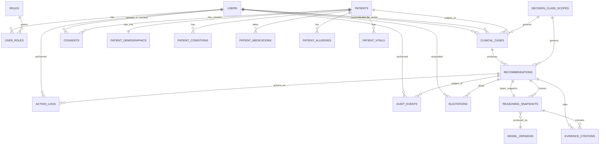
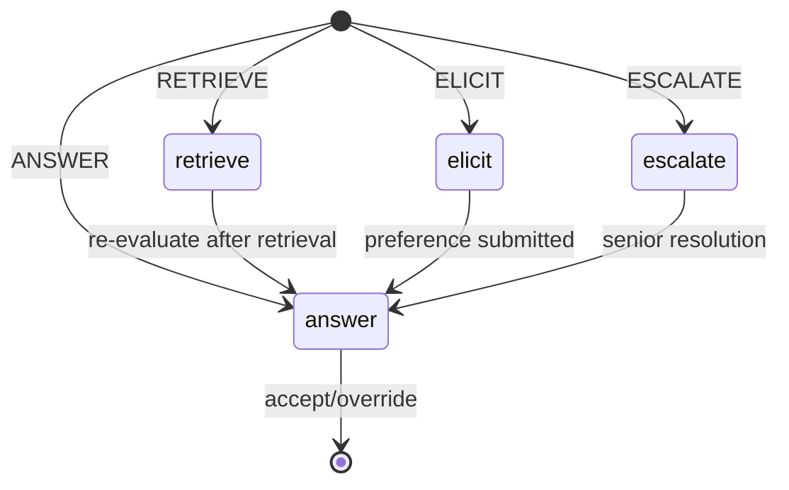
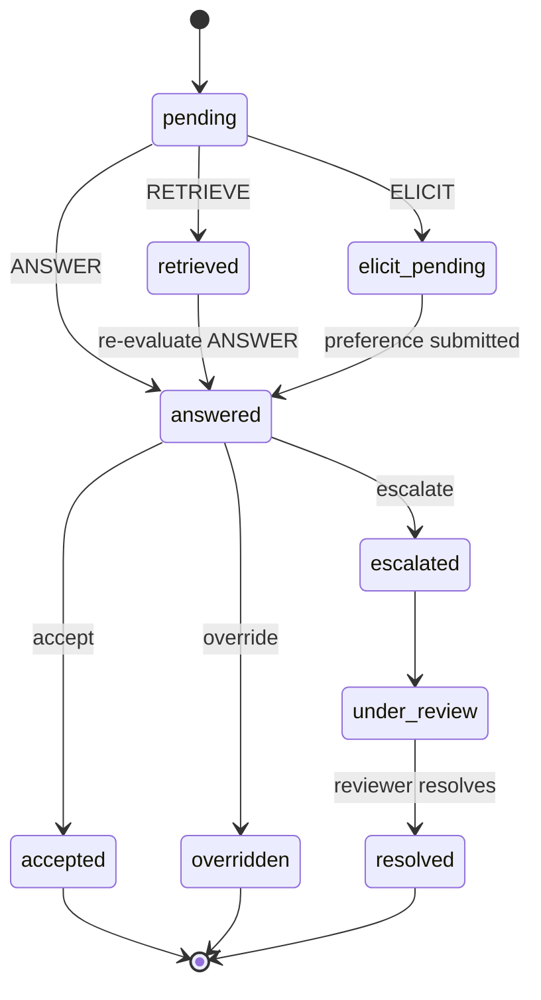

# Data Model

This document mirrors the ER diagram and table-level notes from the README, with
extra detail for backend implementers.

## ER Diagram (canonical)

## Relationship-level notes

- **`users` ↔ `roles`** — many-to-many through `user_roles`. A doctor who is
  also a senior reviewer should keep both roles; one user, multiple roles.
- **`patients` ↔ `users`** — there is **no** direct link. Patients are not
  application users in MVP.
- **`clinical_cases`** has two optional references to `users`:
  `doctor_id` (the owner/prescriber) and `senior_reviewer_id` (assigned on
  escalation). Reviewer is nullable until escalation happens.
- **`recommendations.latest_snapshot_id`** is a circular FK to
  `reasoning_snapshots`. Implemented with `DEFERRABLE INITIALLY DEFERRED`
  in Postgres and inserted in a single transaction in SQLite. The
  recommendation row and the first snapshot row are written in the same DB
  transaction so the cycle is fine.
- **`reasoning_snapshots.sequence_number`** is monotonic per recommendation
  (0 for first run, 1 for the retrieve re-evaluation, etc.).
- **`audit_events`** indexes:
  - `(occurred_at DESC)` — log timeline
  - `(actor_user_id, occurred_at DESC)` — "what did this person do"
  - `(target_type, target_id, occurred_at DESC)` — "everything that
    happened to this object"

## Routing decision → UI state

## Recommendation lifecycle

## Tables

The full list of tables, in alphabetical order:

| Table | Purpose | Notes |
|---|---|---|
| `action_logs` | Every clinician-visible action | Append-only-ish (history); `payload_json` extras |
| `audit_events` | Append-only audit log | DB trigger blocks UPDATE/DELETE |
| `clinical_cases` | A case under a doctor's care | `decision_class` is a denormalized string |
| `consents` | Patient consent records | Reserved; UI deferred to Phase 4 |
| `decision_class_scopes` | MVP-scope enforcement | `in_scope=false` blocks opioid + EOL classes |
| `elicitations` | Recorded preference answers | Options snapshot frozen at write-time |
| `evidence_citations` | Citations made by a snapshot | Same shape whether mock or CARMA |
| `model_versions` | Tracks which engine version produced which snapshot | One row per (provider, name) |
| `patient_allergies` | Patient allergy list | Append-only |
| `patient_conditions` | Patient diagnoses | ICD-10-ish code + label |
| `patient_demographics` | One-to-one with patients | Demographics updates don't lock patient row |
| `patient_medications` | Patient medication list | RxNorm-ish code + dose |
| `patient_vitals` | Vitals events | Append-only by design |
| `patients` | Patient identity | External MRN placeholder |
| `recommendations` | A recommendation lifecycle on a case | Pointed at by actions |
| `reasoning_snapshots` | Immutable per-run record | Full reasoning trail reconstruction |
| `roles` | Role names | Seeded |
| `user_roles` | M-to-M users↔roles | Composite PK |
| `users` | Staff users | Email + password_hash + status |
